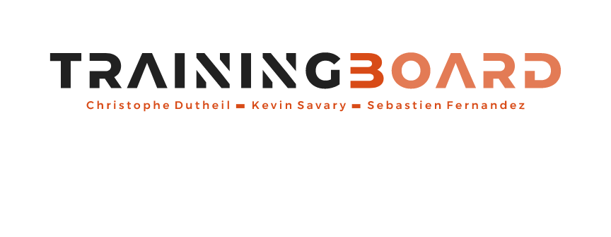

# trainingBoard  - *(Gestion de Formation)*
Afin de se développer et d’être davantage productive, une organisation doit valoriser et augmenter les connaissances de ses équipes grâce à la formation continue. On parle alors de gestion de la formation.

La gestion de la formation consiste à gérer, suivre et contrôler toutes les données concernant les formations, passées, présentes, à venir, de l’entreprise en contrôlant et optimisant le budget formation. La gestion de la formation représente un réel levier stratégique pour l’entreprise. Il est donc important de choisir le bon outil de gestion de la formation.

## Software
> **Outil de démonstration pour une meilleure approche des formations, ainsi que de leur suivie.**

* dotNet Framework [**4.8**](https://dotnet.microsoft.com/download/dotnet-framework)  
* Microsoft Visual Studio 2019 *([**Community Version**](https://visualstudio.microsoft.com/fr/vs/community/))*

## Initiateurs & Participants
* `Christophe Duteil`, `Kevin Savary`, `Sebastien Fernandez`
> **Outil en développement sur le long terme...**

## License
Software sous **MIT License**  
Lien: [FR](https://fr.wikipedia.org/wiki/Licence_MIT), [EN](https://en.wikipedia.org/wiki/MIT_License)

## DevLog
On-going...
